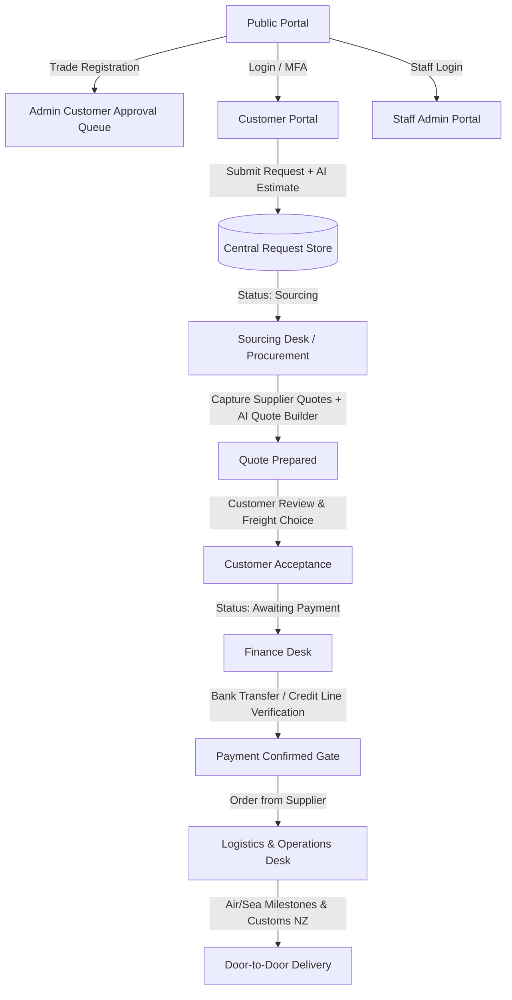

# Procurly by Autohub — B2B Procurement & Logistics Portal Implementation Plan

Procurly is Autohub New Zealand's flagship AI-assisted B2B automotive procurement platform. It serves as the **Coordination Layer, Procurement Facilitator, and Logistics Enabler** connecting approved automotive trade customers (dealers, workshops, fleet operators) with Autohub's global parts supplier and freight network.

The platform eliminates fragmented communication (spreadsheets, emails, WeChat, manual freight tracking) by providing an end-to-end door-to-door procurement workflow:
`Register → Submit Part Request → Supplier Sourcing → Customer Quote → Freight Selection → Customer Approval → Payment Gate → Procurement → Shipping & Customs → Delivery → Completion`.

---

## User Review Required

> [!IMPORTANT]
> **MVP Scope & Architectural Highlights**:
> 1. **Zero Catalogue Principle**: Autohub is strictly a procurement coordination and logistics facilitation service, not a static parts catalogue.
> 2. **Branding & Visual Design**: Built using Autohub Red (`#ed2025`) and Autohub Deep Navy (`#2b4499`) with modern Inter typography, dark slate accents, responsive mobile/tablet/desktop layouts, and polished glassmorphism cards.
> 3. **Payment Gate Rule**: Strictly enforced workflow where procurement actions cannot proceed until payment is confirmed (via Direct Bank Transfer with NZ reference or approved Trade Credit account).
> 4. **AI MVP Integration**:
>    - AI Quote Generator with landed cost and margin optimization.
>    - Semantic search across past orders with intelligent supplier recommendations.
>    - Instant landed cost and transit estimator during request submission.
>    - AI-assisted message replies and automated customer status advisories.
> 5. **Interactive Persona Switcher**: Includes a 1-click role switcher in the header to effortlessly test and demonstrate all 5 roles: Customer Trade Account, Sourcing Specialist, Logistics Coordinator, Finance Officer, and System Administrator.

---

## Open Questions

None at this stage. All requirements align with the provided MVP specifications, New Zealand Privacy Act 2020 compliance, and B2B trade requirements.

---

## Proposed Architecture & Component Structure



### Component Hierarchy

```
src/
├── app/
│   ├── layout.tsx                # Inter font, Meta SEO, Toast provider, Global Styles
│   ├── page.tsx                  # Public Landing Page (Hero, Value Prop, How It Works, Door-to-Door, CTA)
│   ├── about/page.tsx            # About Procurly & Autohub's logistics legacy
│   ├── contact/page.tsx          # Contact & enquiry form with Auckland/Christchurch office details
│   ├── register/page.tsx         # 5-Step Customer Onboarding Wizard (NZBN, Contacts, GST, MFA, T&C)
│   ├── login/page.tsx             # Login with MFA simulation & 1-Click Role Switcher
│   ├── terms/page.tsx            # Terms & Conditions
│   ├── privacy/page.tsx          # Privacy Policy (NZ Privacy Act 2020)
│   ├── portal/                   # Customer Portal
│   │   ├── layout.tsx            # Customer header, navigation, credit indicator, notifications
│   │   ├── page.tsx              # Customer Dashboard (KPIs, active requests, action required)
│   │   ├── new-request/page.tsx  # Part Request Wizard + VIN Decoder + AI Cost/Transit Estimator
│   │   ├── requests/page.tsx     # Request History with search, filter, status tags
│   │   ├── requests/[id]/page.tsx# Request Detail: 15-stage timeline, Quote, Freight, Messaging, Docs
│   │   ├── invoices/page.tsx     # Invoices & Receipts download view (NZ GST 15% compliant)
│   │   └── settings/page.tsx     # Branch address book, team members, security
│   └── admin/                    # Staff Administration Portal
│       ├── layout.tsx            # Staff layout, global search, role indicator, audit ticker
│       ├── page.tsx              # Admin overview & Role-aware dashboard redirection
│       ├── sourcing/page.tsx     # Sourcing Desk: Multi-supplier quotes, AI Quote Generator, Margin Calc
│       ├── logistics/page.tsx    # Logistics Desk: Freight manager, Milestones, Carrier tracking, Customs
│       ├── finance/page.tsx      # Finance Desk: Payments queue, Bank transfer reconciliation, Credit mgmt
│       ├── customers/page.tsx    # Customer Account Approval queue & Trade limits
│       └── settings/page.tsx     # System config (margins, freight base, GST, audit logs, notification rules)
├── components/
│   ├── Navbar.tsx                # Public navigation & portal jump
│   ├── Footer.tsx                # Public footer with NZ regulatory notices
│   ├── PersonaSwitcher.tsx       # 1-Click role preview toolbar
│   ├── StatusBadge.tsx           # Standardized 15 lifecycle + 6 exception status badges
│   ├── LifecycleTracker.tsx      # Visual step tracker for request lifecycle
│   ├── AIQuoteModal.tsx          # AI Quote Synthesis modal with margin calculation
│   ├── AISmartSearch.tsx         # Semantic search and recommendation bar
│   ├── InvoiceViewer.tsx         # Print/Downloadable NZ GST Tax Invoice & Receipt
│   ├── MessagingThread.tsx       # Customer <-> Staff chat with AI Auto-Reply generator
│   └── CookieConsent.tsx         # NZ Privacy Act 2020 consent banner
├── lib/
│   ├── types.ts                  # Domain models (Request, Quote, Supplier, Shipment, Customer, User)
│   ├── mockData.ts               # Seed data for 6 realistic NZ trade requests across lifecycle
│   ├── store.ts                  # Reactive client store with localStorage persistence & event triggers
│   └── aiService.ts              # AI quote generation, cost estimation, and response drafting logic
└── styles/
    └── globals.css               # Brand colors (#ed2025, #2b4499), glassmorphism, responsive utilities
```

---

## Proposed Changes

### Configuration & Setup
1. Initialize Next.js project with TypeScript, Tailwind CSS, and Lucide Icons in `e:\autohub`.
2. Configure Tailwind CSS color scheme:
   - Primary: `autohub-red` (`#ed2025`), `autohub-red-dark` (`#c81015`)
   - Brand: `autohub-navy` (`#2b4499`), `autohub-navy-dark` (`#1b2d6b`)
   - Slate, Gray, Status accent palettes.
3. Configure metadata, OpenGraph, schema markup, robots.txt, and sitemap for SEO.

### Core Domain Models & State (`src/lib/types.ts`, `src/lib/store.ts`, `src/lib/mockData.ts`)
- Model the 15 standard lifecycle statuses:
  1. `SUBMITTED`
  2. `SOURCING`
  3. `QUOTE_PREPARED`
  4. `AWAITING_CUSTOMER_APPROVAL`
  5. `AWAITING_PAYMENT`
  6. `PAYMENT_CONFIRMED`
  7. `ORDERED_FROM_SUPPLIER`
  8. `SUPPLIER_DISPATCHED`
  9. `RECEIVED_AT_SHIPPING_FACILITY`
  10. `IN_TRANSIT`
  11. `ARRIVED_IN_NZ`
  12. `CUSTOMS_CLEARANCE`
  13. `OUT_FOR_DELIVERY`
  14. `DELIVERED`
  15. `COMPLETED`
- 6 Exception statuses: `SOURCING_EXCEPTION`, `LOGISTICS_EXCEPTION`, `PAYMENT_DISPUTED`, `CUSTOMER_REJECTED`, `CANCELLED`, `ON_HOLD`.
- Data persistence via client-side reactive store ensuring state changes made in staff desks immediately reflect in the customer portal and vice versa.

### Public Website
- High-impact Landing Page showcasing Procurly's door-to-door coordination model.
- Interactive Part Request Quick-Tracker in hero.
- 5-Step Customer Registration wizard capturing NZBN, Legal/Trading name, Multi-branch addresses, Accounts & Workshop contacts, GST number, Terms & Privacy consent.
- Compliance pages (NZ Privacy Act 2020 & T&Cs).

### Customer Portal
- Clean executive dashboard with trade credit widget ($25,000 credit line / available balance).
- Part Request Wizard with VIN format validation, photo/document upload simulator, and instant AI cost & transit preview.
- Detailed Request View with 15-stage visual progress tracker.
- Quote Review with side-by-side Air Express vs Sea Freight breakdown, pricing schedule, and 1-click acceptance.
- Bank transfer instructions (with NZ bank account & reference number) + Credit account checkout.
- NZ GST Tax Invoice & Official Receipt generator.
- Live shipment tracking with carrier links and port milestones.
- Real-time customer messaging thread with Autohub staff.

### Staff Administration Portal
- **Procurement / Sourcing Desk**: Multi-supplier quote entry, currency converter, side-by-side comparison, AI Quote Generator with automated margin calculation, Issue Quote button, Exception handling.
- **Logistics Desk**: Air vs Sea freight manager, carrier & tracking code assignment (DHL Express, Mainfreight, Autohub Sea Line), 1-click milestone updates, Customs clearance flags.
- **Finance Desk**: Payments queue, manual bank transfer reconciliation, sequential NZ GST tax invoice issuing, trade credit approval & limit adjustments.
- **System Admin**: Customer account onboarding approval queue, staff role management, system margin & freight default configs, full audit event trail.

### AI Features (MVP)
- **AI Smart Quote Generator**: Predicts landed costs and optimal supplier selection using past parts data.
- **Semantic Search**: Instant search matching natural query or OEM part numbers with supplier recommendations.
- **AI Instant Estimator**: Shows customers estimated landed cost & transit window prior to submission.
- **AI Auto-Reply Assistant**: One-click professional update generation for quotes, customs holds, and delivery ETAs.

---

## Verification Plan

### Automated Verification
1. `npm run build`: Verify TypeScript compilation, linting, and Next.js production build without errors.
2. Verify all routes render properly (`/`, `/register`, `/login`, `/portal`, `/portal/new-request`, `/portal/requests/[id]`, `/admin`, `/admin/sourcing`, `/admin/logistics`, `/admin/finance`, `/admin/customers`).

### Browser Testing with Interactive Verification
1. **Public Site**: Test responsive layout, interactive quick tracker, registration wizard step-by-step submission, and cookie banner.
2. **Customer Journey**:
   - Log in as approved trade customer (*Apex Motors Auckland*).
   - Submit new part request (*2020 Toyota Hilux Alternator OEM*).
   - Verify generated reference number format (`AH-P-000129`).
3. **Staff Sourcing**:
   - Switch to Sourcing Specialist role.
   - View new request in Sourcing queue.
   - Use AI Quote Generator to synthesize supplier quotes, calculate 18% margin, and publish quote with Air & Sea freight options.
4. **Customer Acceptance & Payment**:
   - Switch to Customer.
   - Review quote, select Air Express freight option, and accept.
   - View payment screen, verify bank transfer details or select trade credit line.
5. **Finance Verification**:
   - Switch to Finance role.
   - Confirm bank payment receipt, unlock payment gate, generate NZ GST Tax Invoice.
6. **Logistics Tracking**:
   - Switch to Logistics role.
   - Mark ordered from supplier, assign DHL tracking number, advance through port and customs clearance milestones.
   - Switch to Customer to verify live milestone update and download tax invoice.
